# Credit_Risk_Analysis

## Overview of the Project

This project is to research on multiple machine learning algorithms to identify which one would best suite for a credit risk analysis. 

The big difference with this analysis is that getting higher percentage accuracy is not enough as the number of high risk applications are small and need to be identified. This also brings in challenges of having a smaller dataset for analysis compared to the good applications.

## Resources
- Data Source: LoanStats_2019Q1.csv from LendingClub
- Software: Python, Scikit, imbalanced-learn, jupyter notebook
---

## Results

Below were the results from the different algorithms used with the data.

1. Random Oversampling
    - Accuracy: 64.56%
    - High Risk Precision: 0.01
    - Low Risk Precision: 1.00
    - High Risk Recall: 0.61
    - Low Risk Recall: 0.68

    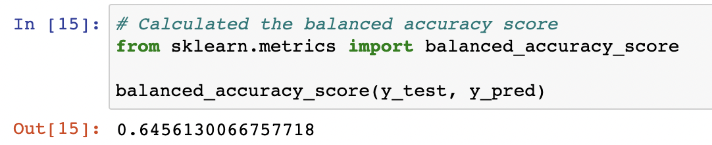

    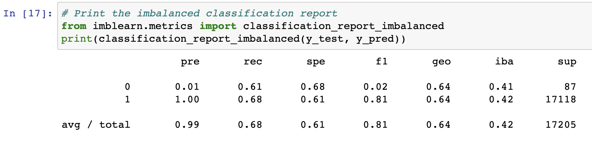

2. SMOTE Oversampling
    - Accuracy: 62.34%
    - High Risk Precision: 0.01
    - Low Risk Precision: 1.00
    - High Risk Recall: 0.61
    - Low Risk Recall: 0.64

    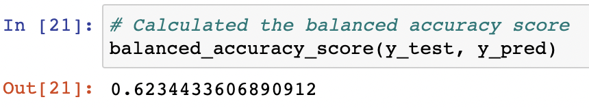

    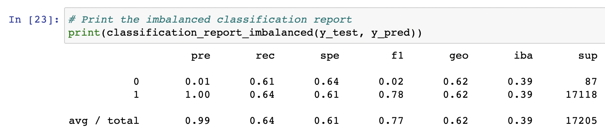

3. Undersampling
    - Accuracy: 52.27%
    - High Risk Precision: 0.01
    - Low Risk Precision: 1.00
    - High Risk Recall: 0.60
    - Low Risk Recall: 0.45

    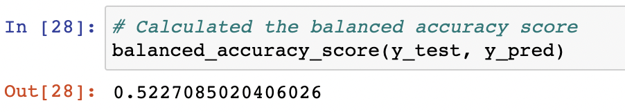

    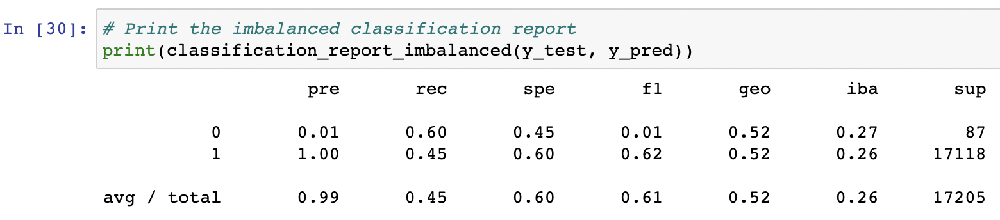

4. Combination Over and Under Sampling
    - Accuracy: 63.96%
    - High Risk Precision: 0.01
    - Low Risk Precision: 1.00
    - High Risk Recall: 0.70
    - Low Risk Recall: 0.58

    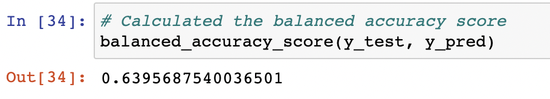

    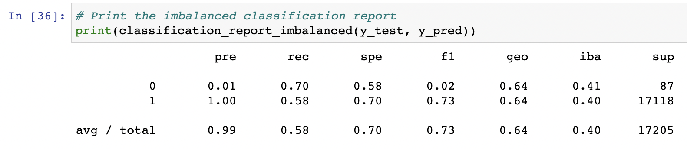

5. Balanced Random Forest
    - Accuracy: 78.78%
    - High Risk Precision: 0.04
    - Low Risk Precision: 1.00
    - High Risk Recall: 0.67
    - Low Risk Recall: 0.91

    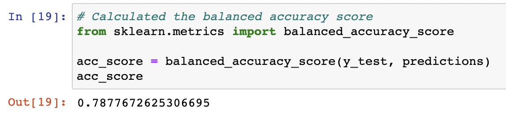

    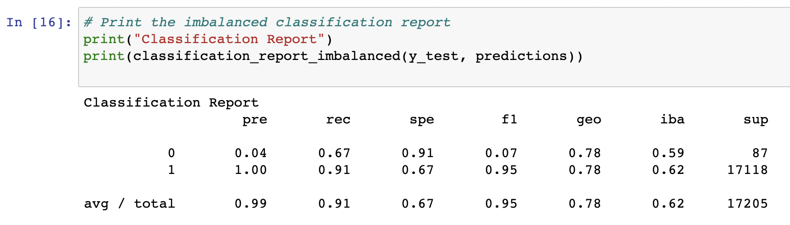

6. Easy Ensembler
    - Accuracy: 92.54%
    - High Risk Precision: 0.07
    - Low Risk Precision: 1.00
    - High Risk Recall: 0.91
    - Low Risk Recall: 0.94

    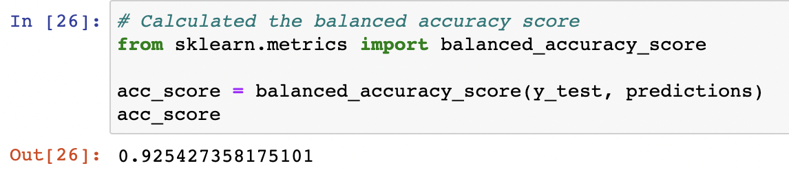

    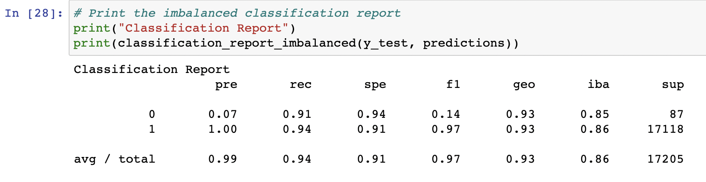

---

## Summary

Oversampling the data looked to be better than undersampling with the accuracy scores averaging in the 60's vs the 50's. But comparing to this ensembling algorithms proved much better.

Based on the results we can clearly see that the Easy Ensembler algorithm had the highest accuracy. They key point here is that we need to ensure all high risk applications are identified even if there are some false positives. Hence recall is more important than precision.
